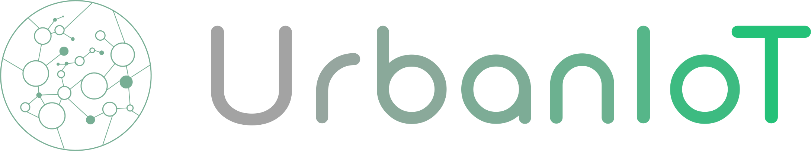

# UrbanIoT


# Azure Maps

# Azure SQL DB

# Event Hubs Namespace
## Event Hubs
### events
The Event Hub *events* has a partition count of *4* and a message retention of *7 days*.

### telemetry
The Event Hub *telemetry* has a partition count of *4* and a message retention of *7 days*.

# Azure Function
## TTN Events
### Configuration
```bash
EVENTHUB_CONNECTION_STRING = YourEventHubConnectionString

STACK_API_KEY = YourSuperSecretKey
STACK_APPLICATION_ID = YourApplicationId
STACK_BASE_URL = https://eu1.cloud.thethings.network/api/v3
```

## Telemetry To DB
### Configuration
```bash
SQLDBConnectionString = YourSqlConnectionString
EventHubConnectionAppSetting = YourEventHubConnectionString
```
# Azure IoT Hub
## Message routing

### Custom Endpoints

#### StackEvents
Endpoint *StackEvents* to Event Hubs Namespace. Sends to event hub namespace instance *events*, uses *Key-based*-Authentication. 

#### TelemetryEvents
Endpoint *TelemetryEvents* to Event Hubs Namespace. Sends to event hub namespace instance *telemetry*, uses *Key-based*-Authentication. 

### Routes

#### TTSTwinChangeEvents
Route *TTSTwinChangeEvents* sends *Device Twin Change Events* to endpoint *StackEvents*, using the routing query `IS_OBJECT($body.properties.desired) OR IS_OBJECT($body.tags)`.

##### TTSDeviceLifecycleEvents
Route *TTSDeviceLifecycleEvents* sends *Device Lifecycle Events* to endpoint *StackEvents*, using the routing query `true`.

#### NewTelemetryEvents
Route *TTSDeviceLifecycleEvents* sends *Device Telemetry Messages* to endpoint *TelemetryEvents*, using the routing query `true`.